  

  
  
  
  

## Sobre

Sou **Analista de TI Júnior**, com rotina em infraestrutura, suporte e ambientes Windows, em transição para **segurança defensiva (SOC / Blue Team)**.

Aprendo construindo: monto o ambiente do zero, protejo, ataco em laboratório isolado e documento o que foi detectado — e o que passou despercebido.

## Projeto em destaque

### 🛡️ [Nexora Security Lab](https://github.com/imleozzin/nexora-homelab)

Laboratório que simula a rede de uma empresa fictícia de ~40 funcionários, do zero até a resposta a incidentes:

**construir → proteger → monitorar → atacar → detectar → responder**

| Etapa | O que foi feito |
|---|---|
| Rede | pfSense roteando 4 zonas isoladas (Servidores, Usuários, Segurança, Ataque) com regras de menor privilégio |
| Identidade | Active Directory em Windows Server 2025: OUs, usuários, grupos, DNS e scripts PowerShell |
| Hardening | GPOs de endurecimento (bloqueio de conta, auditoria avançada) e proteção das estações |
| Monitoramento | Wazuh como SIEM + Sysmon nos endpoints, com coleta de logs Windows e Linux |
| Ataque | Cenários executados a partir de um Kali em zona sem internet, mapeados no MITRE ATT&CK |
| Resposta | Relatórios de incidente com timeline, evidências, contenção e lições aprendidas |

> Tudo é ambiente de laboratório: os ataques têm como alvo apenas máquinas do próprio lab, em rede isolada.

## Stack

**No trabalho**

**No laboratório**

**Estudando**

## Agora

- 🎯 Buscando a primeira oportunidade em **SOC / Blue Team / Segurança da Informação (Júnior)**
- 📚 Preparando a certificação **ISC2 Certified in Cybersecurity (CC)**
- 🧪 Praticando investigação e detecção no TryHackMe e no meu lab

## Contato

[LinkedIn](https://www.linkedin.com/in/leonardo-ramalho-/) · [TryHackMe](https://tryhackme.com/p/Imleozin)
